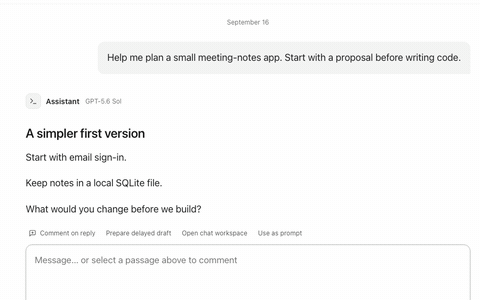
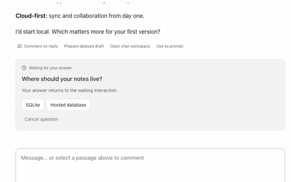
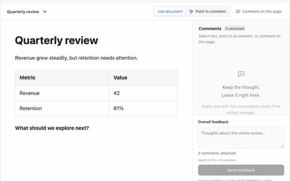
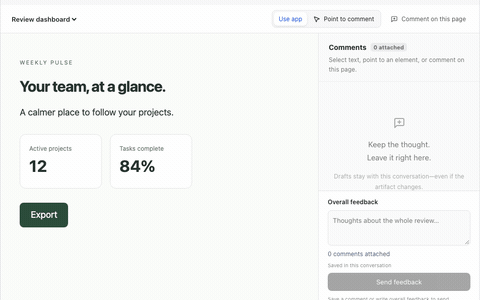
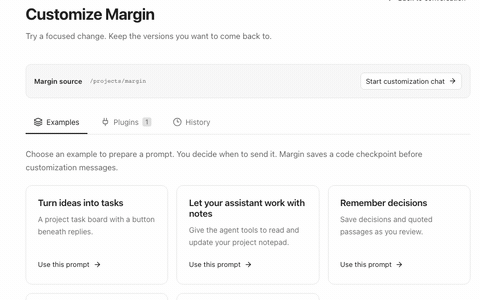
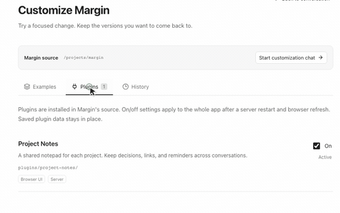
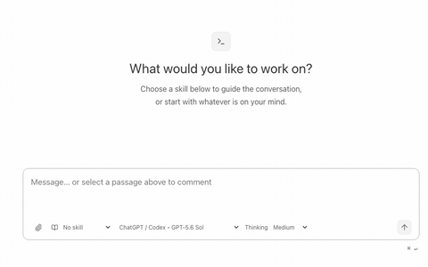
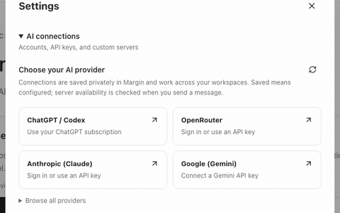
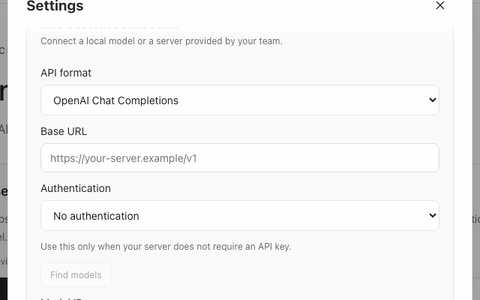

## Margin in action

Short demos with example content. Each clip loops in five seconds.

| | |
| --- | --- |
| **Comment directly on AI replies**  Select a passage and leave feedback in the margin. | **Shape the task together**  Choose a direction, add your constraints, and refine the plan. |
| **Review generated documents**  Attach feedback to the exact passage in a Markdown artifact. | **Point and comment on web apps**  Point to an element and say what should change. |
| **Keep project contexts separate**  Switch projects with their own conversations and shared notes. | **Ask AI to customize Margin**  Pick a starting idea, then describe the change you want. |
| **Extend Margin with plugins**  Manage extensions such as the project notepad. | **Choose your workflow**  Start a conversation with a Pi skill such as Shape with me. |
| **Bring subscriptions and API keys**  Connect ChatGPT / Codex, Claude, OpenRouter, and more. | **Use local or custom models**  Set your server URL, authentication, and model ID. |

The workspace clip shows separate project contexts. Filesystem sandbox enforcement is described in the README; it is not demonstrated by this recording.
