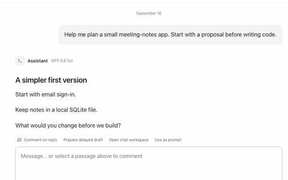
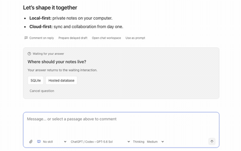
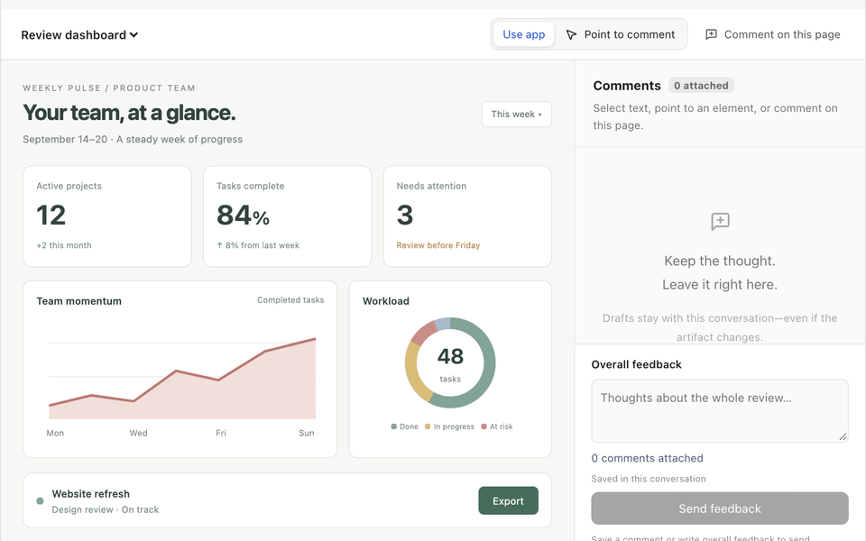
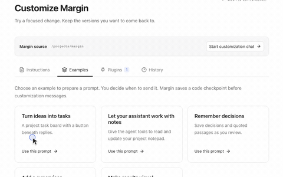
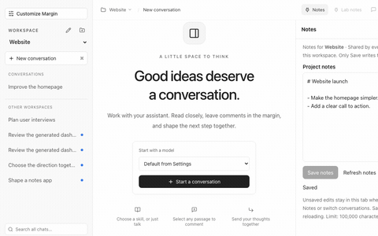

# Margin: a human-first AI workspace

Margin is a local AI workspace for macOS, **built for humans who want to actively shape what AI produces**. While fully-autonomous agents focus on independent execution, Margin makes it easy to guide the approach, give precise feedback, and customize the workspace around your workflow.

**Margin works with your existing AI subscriptions**: Codex/ChatGPT, OpenRouter, Claude (extra-billing), Gemini, Deepseek and 100s of others. It also works with local models or models hosted on your server

## How Margin lets you shape the work AI produces

### Contextual feedback to AI = better outputs



_Inline comments (Google-Docs style) make it easy to give lots of feedback to the agent._

### AI seeks your inputs before execution



_Every task starts with a round of discussion between you and agent on what would be a meaningful outcome._

### Point your AI to what you want changed



_Reports, plans and prototypes (in markdown and html) open within Margin to let you provide feedback to AI by pointing to precisely what you want changed._

### AI customizes Margin around your workflow



_Ask AI to add features, change the interface, or build plugins for your workflow. Want to change something in Margin? Simply describe it._

### Isolated workspace for safe AI changes



_Margin isolates each workspace via an [embedded sandbox](https://github.com/nikvdp/cco) so that your AI working in one folder cannot change or delete anything outside that folder._


## Install and run

The first installer targets native **macOS** with Node **22.19+** (Node 24 LTS recommended), npm, and Git. Clone this repository into its own folder, then run:

```sh
bash install.sh --start
```

The installer installs locked dependencies, builds Margin, verifies the real filesystem sandbox, and starts the app. Pi **0.85.1** and a pinned cco copy are included; no separate global Pi or cco installation is required. It leaves global Node/Git/Pi installations alone and refuses to replace existing dependency/build directories. Later starts use `bash start.sh`.

## About

Margin is built by [@paraschopra](x.com/paraschopra) and thanks the following projects

- [Pi](https://github.com/earendil-works/pi) for the SDK that powers the agent and connectors
- [CCO](https://github.com/nikvdp/cco) for the sandbox to allow safe execution of agents

## Margin is WIP, and currently meant for technical audience

Margin is an experiment exploring how humans can help better shape the AI work.

This is an early release for technical users. Please expect things to break, and share feedback through GitHub issues.

## License

Copyright (c) 2026 Paras Chopra.

Margin's original code and documentation are licensed under the [Apache License 2.0](LICENSE).
Third-party components retain their own licenses, including the vendored [CCO code (MIT)](vendor/cco/LICENSE).
