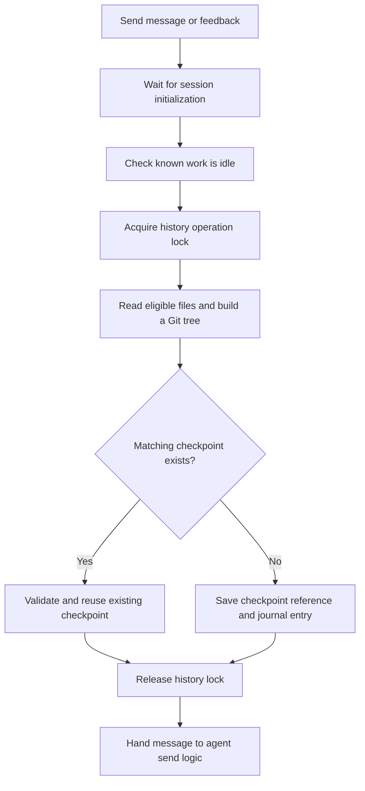

# Code checkpoints: behavior, recovery, and improvements

Committed baseline: `a9bac69`, reviewed on 16 September 2026. Separate send-guard changes present in the working tree are identified below as in progress.

A checkpoint preserves the eligible files in Margin's own source folder so a customization can be undone. **Every source-workspace message that passes the send guards triggers a full capture before the agent receives it.** Creating a conversation alone does not create a checkpoint. Unchanged captures reuse an existing checkpoint, but still perform the file scan and hashing.

This document describes current behavior first. The improvement proposals at the end are not implemented by the checkpoint hang fix.

**Deferred next direction:** the user questioned requiring code-diff review and suggested worktrees as a better foundation. [Worktree customization, previews, and undo](worktree-customization-proposal.md) records the proposed user experience, how worktrees could support it, unresolved activation/data decisions, and a plan for evaluating it later. This leaves the current implementation unchanged.

## In plain language

### Is the commit shown at the end of an agent task a checkpoint?

When the agent runs `git commit` and reports **Committed `abc123`**, that is a normal commit on your branch. For example, `a9bac69` (**Fix checkpoint hangs from piped Git input**) is a normal commit on `main`, visible in that branch's `git log`.

The automatic checkpoint is a separate save made **before** the agent starts the turn:

1. You ask Margin to change something. Margin saves or reuses a checkpoint of the existing code.
2. The agent edits the code.
3. If the agent commits its finished work, it creates a normal commit on your branch. Finishing a response does not automatically perform this step.

|                                  | Automatic checkpoint                                         | Normal branch commit                    |
| -------------------------------- | ------------------------------------------------------------ | --------------------------------------- |
| Purpose                          | Preserve the code before a task, so you can undo its changes | Record changes in your branch's history |
| Created by                       | Margin automatically before a source-workspace send          | You or the agent running `git commit`   |
| What is saved                    | Eligible working files, including earlier uncommitted edits  | The state in Git's staging area         |
| Where you see it                 | **Customize Margin → History**                               | Your branch's **`git log`**             |
| Included in a normal branch push | No                                                           | Yes, when you push that branch          |

Both use Git commit objects internally, but they are separate saved versions. Margin keeps checkpoint commits under its own references instead of adding them to your branch. It does not convert a checkpoint into the agent's final commit.

Earlier uncommitted edits are one reason checkpoints are useful. Suppose you changed a button colour without committing, then asked the agent to change the layout. The checkpoint preserves your button colour. Restoring it can undo the layout change while keeping that earlier edit; returning to the last branch commit might lose both.

### Who names checkpoints, and where are they?

Open **Customize Margin → History**. The list shows each checkpoint's name, timestamp, and whether it was saved manually or automatically.

Margin names new automatic snapshots **Before customization** or **Before changing plugin settings**. New backup snapshots made during restore are named **Before restore · date/time**. Reusing an existing checkpoint retains its original name and timestamp. For a manual checkpoint, enter your own name and click **Save checkpoint**.

Automatic names are currently generic. There is no direct checkpoint-to-chat-message association, so identifying the correct snapshot can require checking its timestamp and preview.

### How do I undo a mistake today?

1. Finish or stop active agent work.
2. Open **Customize Margin → History**, choose a checkpoint, and click **Preview changes**.
3. Check the listed file changes and click **Save current state & restore**. Margin preserves the current code first, then replaces the working files with the selected snapshot.
4. Rebuild and restart if Margin says activation is required. **Return to before the last restore** lets you preview and restore the preserved state if you change your mind.

Restore applies the whole captured code state, which can undo several changes made since that snapshot. Chats and notes stay intact. Your branch and staging area remain unchanged; the restored code can therefore appear as working-file changes against your current branch commit.

You can ask the agent to identify a suitable checkpoint or help with recovery. An agent with terminal access can use the recovery commands, but **“undo my last message” is not a built-in checkpoint action**. There is no automatic mapping from that message to the correct snapshot. The History interface is the normal restore route while work is idle. The CLI does not enforce the app's busy checks and should not be used to bypass active-work protection.

### Would “Saving checkpoint…” interrupt me?

In the proposed design, this is an informational status with no confirmation to click. The submitted message still waits for its checkpoint before the agent can begin editing: the undo point must exist before the changes start.

Moving the save to a background worker would let the interface remain responsive for reading, navigation, and typing the next draft. Another editing task in the same source workspace must still wait. Background saving does not make concurrent source edits safe, and there is currently no automatic queue for conflicting source sends.

### Is making checkpoints faster the main improvement?

Yes: normal saves should be quick enough to be barely noticeable. The current full scan and repeated Git process launches are work to measure and reduce. Unchanged code currently avoids another history entry, but does not avoid that work.

The recommendation has two parts:

- **Normal speed:** reuse verified unchanged content and reduce repeated hashing and Git process launches.
- **Failure handling:** run the work outside the thread serving the interface, with a deadline for the whole operation. Even a normally fast command can occasionally hang.

A status label alone does not solve either problem. The committed hang fix changes how input reaches Git and adds a five-second limit per Git command. Faster capture, a whole-operation deadline, and background execution remain further work.

## When it runs

| Action                                                | Current behavior                                                                                                                                                            |
| ----------------------------------------------------- | --------------------------------------------------------------------------------------------------------------------------------------------------------------------------- |
| Create, open, or switch a conversation                | No named checkpoint. Starting the source worker can separately trigger a startup scan.                                                                                      |
| Send a message in the Margin source workspace         | Capture before handing the message to the agent; save or reuse **Before customization**. Applies to first messages, follow-ups, and questions that request no code changes. |
| Send inline or artifact feedback in that workspace    | Uses the same send path and checkpoint gate.                                                                                                                                |
| Send a message in another project workspace           | No automatic Margin-source checkpoint. This feature does not provide rollback for that project's files.                                                                     |
| Finish an agent response                              | No automatic after-response checkpoint. The next source-workspace send captures the resulting code.                                                                         |
| Save a named checkpoint in History or through the CLI | Capture and create a new entry, even if the same state already exists.                                                                                                      |
| Change a plugin's enabled setting                     | Save or reuse **Before changing plugin settings**, then change `margin.plugins.json`.                                                                                       |
| Preview a checkpoint                                  | Capture current files and calculate a diff; no new named entry and no source-file replacement.                                                                              |
| Restore a checkpoint                                  | Save or reuse the current state before replacing files, unless there are no differences.                                                                                    |
| Start the source worker                               | Acknowledge completed restore activation and capture the loaded source tree when history is available; no new named entry.                                                  |

Automatic checkpoint capture is skipped in `MARGIN_TEST_MODE`. The normal application path is in [server/index.ts](../server/index.ts), including `sendBatch`, customization routes, and startup history handling. Artifact feedback also calls `sendBatch`.

For example, the first message saves code state A. Several discussion messages with no edits all scan and reuse A. An agent then produces state B. The next message captures B before the next turn starts. A conversation can therefore have several rollback points. The journal currently has no explicit conversation/message association for them.

## What happens before a source-workspace message

The committed send path at `a9bac69` is:

Failures in the checkpoint stage stop that send before the agent receives it. The browser keeps the original draft until acceptance and restores it on a reported failure. Passing the checkpoint gate does not guarantee later agent acceptance: attachment, skill, or provider checks can still fail.

The idle check covers known sessions and operations in the source worker: active runs, initialization, pending dialogs, tracked child-agent work, plugin work, and maintenance. Under the normal gateway launch, explicit History/plugin mutations additionally check **all started workspace workers**. An automatic checkpoint during a source-chat send uses the source worker's local guard; it does not run that gateway-wide check. The CLI uses the history lock but does not run these application busy checks, so stop the app before CLI recovery.

The history lock is `<data directory>/history/operation.lock`. It contains the owning Node PID. Normal success or an exception releases it. A subsequent operation can recover it if the OS confirms that PID is dead. An alive or unverifiable owner blocks the operation. This is separate from `runtime/owner.sqlite`, which prevents overlapping workspace runtimes. See [runtime recovery](runtime-recovery.md).

## Exactly what gets saved

[CheckpointHistory](../server/checkpoints.ts) requires the Git repository root to match Margin's source root. It lists tracked paths and new, non-ignored paths, then reads their **current working-file contents**. Unsaved editor buffers are not captured; staged contents are not substituted for working-file contents.

The capture records file contents, relative paths, and regular/executable file modes. A tracked file missing from disk is absent from the new tree, preserving its deletion. Plugin source and `margin.plugins.json` are eligible. The current exclusions are:

- Any path component named `.git`, `.margin-data`, `node_modules`, `dist`, `test-results`, or `playwright-report`, plus the configured data directory and its contents.
- Top-level `workspaces`, local `.env*` names except `.env.example`, `.DS_Store`, `.log` files, and temporary `.margin-restore-*` paths.
- Untracked files excluded by Git's ignore rules. Already tracked files remain candidates even if an ignore rule matches, subject to Margin's exclusions above.

These are path rules, not a general secret scanner. A credential placed in an otherwise eligible source file can be captured. Chats, drafts, notes, uploads, and credentials kept inside the excluded data directory are outside code rollback.

Capture refuses unsupported file types and submodules, checks for file changes during reading, and rejects symlinked ancestors. It can record a leaf symlink's target text, but restore does not support replacing symlinks or submodules. Capture is not a filesystem-wide atomic snapshot against unrelated programs editing concurrently.

## How Git and storage are used

Each capture reads and hashes every eligible file with `git hash-object -w --stdin`. A separate temporary Git index assembles these objects into a tree with `read-tree`, `update-index`, and `write-tree`. The user's ordinary Git index is not used for this assembly.

For automatic and pre-restore saves, Margin searches the journal for the most recent entry with the same tree. A match is validated and returned with its existing ID, name, kind, and timestamp. **Deduplication happens after capture**: it avoids another history entry, not another full scan. Manual saves do not request deduplication.

For a new entry, Margin creates a Git commit with `commit-tree`, stores it under `refs/margin/checkpoints/<UUID>`, and records the ID, label, kind, timestamp, commit, and tree in `<data directory>/history/checkpoints.json`. These commits have no parent supplied; the UI presents independent snapshots in a flat list. The journal also records restore/return state and is written via a temporary file and rename.

The ordinary branch, `HEAD`, and staging index are preserved. No Git worktree is created. Git objects can be written even by a preview or an unsuccessful capture; that does not by itself create a usable named checkpoint. There is currently no automatic retention/pruning policy.

Checkpoint refs and their journal must both be preserved for recovery. A normal branch push does not back them up. Source rollback also cannot undo database migrations, changes to external projects, or other external side effects.

## Preview and restore

Preview validates the saved reference/tree, captures the current files, and reports additions, modifications, deletions, and a diff **from the current state to the target**. Its token binds that current tree to the target commit. It does not launch an older version of the app.

Restore performs these steps under the history lock:

1. Capture again and reject the operation if the preview token no longer matches.
2. Check target paths, file types, and collisions with ignored or uncaptured files; load the target contents.
3. Save or reuse a checkpoint of the current state. Capture again to detect changes made while preparing that backup.
4. Persist the target and backup as a pending restore before changing source files.
5. Recheck affected files, remove the required files, and replace others through temporary files and rename.
6. Record the target as current, the backup as the return destination, and clear the pending restore.

An interruption can leave a partially restored working folder. The recorded backup and pending state provide a recovery path; the entire restore is not an atomic filesystem transaction. The History UI's **Return to before the last restore** previews the saved backup and uses the same restore path.

The server compares restored source with the tree recorded at startup. If they differ, normal agent work is blocked until rebuild/restart activates it. Returning to the source state already loaded can remove that requirement. Dependency changes may also require installation before building.

See [the recovery commands](customization-workspace.md#recovery-if-the-interface-breaks). The standalone recovery program is bundled once into the data directory and preserved by later builds. **An older recovery bundle may still contain older checkpoint code, including the pre-fix Git input path.** Updating application source does not update an existing recovery bundle. This follows [scripts/build-recovery.ts](../scripts/build-recovery.ts); versioned recovery updates are proposed below.

## The September 16 hang and the implemented fix

Two live incidents showed the workspace worker blocked inside a synchronous child-process call while its `git hash-object` child waited for input. A separate probe reproduced an intermittent stall when piping the current `src/App.tsx` contents to Git: one of 30 repeated pipe attempts timed out. Thirty attempts using regular-file input completed with the same hash. The exact lower-level reason that the Node/Git pipe stalled was not established.

Commit `a9bac69` changes the shared checkpoint Git runner:

- Captured input bytes are staged in a private temporary file, and Git receives a read-only file descriptor as stdin. It still hashes the captured bytes rather than reopening a potentially changed source path. Commands with no input receive ignored stdin.
- Each Git command gets a **five-second timeout with `SIGKILL`**, so a process ignoring graceful termination cannot hold the synchronous call indefinitely.
- Timeout errors are surfaced; normal exception cleanup closes/removes the input files and releases the enclosing history lock.

This is a persistent source change. Restarting the frozen worker activated it; terminating that worker alone was not the fix.

Validation for that commit: **206 unit tests and the build passed**, plus three full workspace captures. New [regression tests](../tests/checkpoints.test.ts) verify regular-file input, large binary/empty-file round trips, and forced termination of a deliberately hung command followed by a successful retry.

The remaining limits matter: checkpoint work still uses synchronous Git and filesystem calls on the server thread. The five seconds is **per command**, not a whole-checkpoint deadline. A scan involves many commands. Browser progress, request deadlines, process supervision, and automatic recovery were not changed by this commit. An older source checkpoint can also restore code from before this fix.

### Separate send-guard work in progress

At the time of this review, uncommitted changes in the shared working tree add a `SourceSendGuard` reservation while a source send starts, a send-availability endpoint, and a browser conflict notice with a link to the blocking conversation. They also return a previously recorded batch status before checkpointing when a submission is retried. These changes extend the baseline send flow above; they are not part of `a9bac69` or its reported validation.

That work does not change the synchronous capture algorithm, provide a whole-checkpoint deadline, or persist a checkpoint operation before capture. Recommendations below should preserve the new send reservation and extend its status handling rather than duplicate them. Deployment and validation of those separate edits must be checked independently.

## Recommended improvements, in order

The items below improve the existing checkpoint implementation. The later [worktree proposal](worktree-customization-proposal.md) explores a broader change: develop and try candidate versions separately, then integrate/activate them. Decide that direction before undertaking a large redesign of the current History interface; bounded execution and preservation of user work remain requirements in either approach.

### 1. Keep the workspace responsive throughout checkpoint work

Move capture/preview/restore work to a supervised helper process, with per-command limits and an overall operation deadline enforced outside that helper. This isolates synchronous file reads as well as Git calls. Cancellation should stop and reap its managed processes, release locks after work has stopped, and report a bounded failure.

Preserve cross-process exclusion and the source-send reservation when moving capture off the server thread. The reservation must last from the idle check through handoff to the agent or failure. Simply adding `await` without maintaining that exclusion would allow another request to start conflicting work between the idle check, snapshot, and send. Serialize restore and plugin changes through the same coordinator.

### 2. Give sends an explicit, recoverable status

Persist an operation/batch ID before capture and show **Saving code checkpoint…** separately from agent acceptance. Make progress and cancellation available while capture runs. On failure, retain the draft and offer Retry. On a lost response, reconcile the batch's saved status before retrying so one user action cannot start two agent turns.

Complete and validate the in-progress conflict notice and link to the blocking conversation, including background operations without a direct conversation owner. For unresponsive runtimes, offer a workspace restart that verifies identity and actual process termination before replacement. A timeout or missed heartbeat alone must not authorize a second acting runtime.

### 3. Reduce repeated work while preserving useful rollback points

Keep a rollback point before every source-editing turn, including follow-ups. Saving only once per conversation would lose the ability to undo a later edit while retaining earlier successful work.

First move work off the main thread; then profile and reduce one-process-per-file overhead and reuse validated unchanged content. Any cache must account for external edits, additions/deletions, modes, and ignore-rule changes, and fall back to a full capture when uncertain. A watcher event or an unchanged timestamp alone is not sufficient proof of unchanged content. Continue comparing complete tree identities for deduplication.

An explicit read-only conversation mode could skip pre-edit checkpoints if write restrictions are enforced across its tools and plugins. Do not infer that guarantee from a message sounding like a question.

### 4. Make history and recovery easier to maintain

Associate rollback points with the conversation, message, and reason they were created or reused. Offer explicit milestones and a clear return destination. Add measured retention/storage reporting while preserving current, return, and pending-restore recovery references.

Version the standalone recovery bundle. Install tested updates alongside a known working recovery version, so fixes reach recovery tooling without depending on the source that might be restored away. Expose the recovery version and backup requirements in History.

### Acceptance checks for those improvements

- A stalled Git child or helper cannot block status requests or strand a send in **Sending** indefinitely; operation deadlines also cover many individually slow commands.
- Cancellation, helper crashes, Ctrl+C, and wrapper-only exits stop verified managed work before locks or runtime ownership can be reused.
- Concurrent sends/restores cannot bypass the source-workspace reservation; retries never duplicate an accepted agent turn.
- Draft text survives failure, disconnect, refresh, and restart. Timeout reporting distinguishes an unaccepted message from an outcome requiring reconciliation.
- Unchanged follow-ups avoid redundant work without missing external edits; rollback still preserves earlier successful turns, excluded data, and the ordinary Git branch/index.
- Recovery remains usable after restoring away the current source, and its installed version is identifiable.
