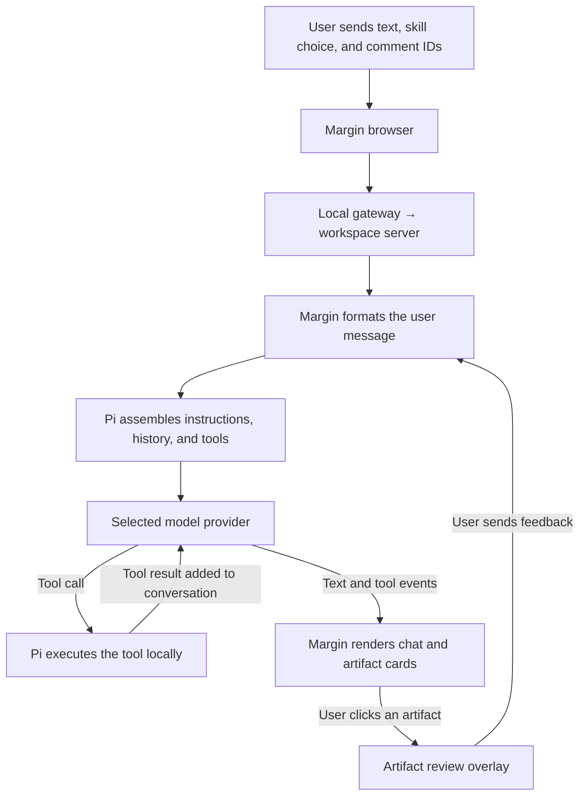

# Prompt, tool, and artifact flow

Margin is a browser interface around a Pi agent session. Pi assembles the model request and executes tools. Margin supplies browser-specific instructions, turns comments into user messages, and renders the resulting text, tool results, and artifacts.

This document describes the implementation using the pinned `@earendil-works/pi-coding-agent` **0.85.1** SDK. Examples are reconstructions from the code, not captured provider requests. Actual requests depend on the workspace, local Pi configuration, selected skill, model, extensions, and conversation history.

## Does installing Margin automatically provide `present_artifact`?

**Yes. Margin automatically registers `present_artifact` with each main Pi chat session it creates. No separate tool installation or Pi extension setup is needed.**

The tool implementation ships in [server/artifact-tool.ts](../server/artifact-tool.ts). During `LiveSession.initialize()`, [server/sessions.ts](../server/sessions.ts) supplies it to the Pi SDK through `createAgentSession({ customTools: [...] })`:

```ts
// Excerpt: other session configuration and tools omitted.
const result = await createAgentSession({
  cwd: this.project.path,
  // model, settings, resource loader, session manager, ...
  customTools: [
    // Margin's managed bash tool, ...
    presentArtifactTool(this.store, this.info.id, this.project),
    ...this.plugins.flatMap((p) => p.tools?.(this.pluginContext(p.id)) ?? []),
  ],
});
```

The SDK adds these definitions to the session's tool registry and active tools. It supplies their model-facing schemas and connects calls to their local `execute` functions. The artifact tool closes over this conversation's storage, ID, and workspace, so its results belong to that conversation.

| Situation                                                 | Is the tool supplied automatically?                                        |
| --------------------------------------------------------- | -------------------------------------------------------------------------- |
| Someone installs/builds/starts this version of Margin     | Yes, when Margin initializes a main chat session                           |
| A new chat in another workspace                           | Yes, with that workspace and conversation's context                        |
| Reopening a saved chat after a restart                    | Yes, when Margin recreates its live Pi session                             |
| Choosing **No skill**                                     | Yes; registration is independent of skill selection                        |
| Launching standalone `pi` in a terminal                   | No; Margin has not installed a global Pi extension                         |
| A plugin creates a background agent through `createAgent` | No; that path has a separate tool setup and defaults to an empty allowlist |

The normal Margin installation includes the pinned Pi SDK dependency and this tool's source. Registration happens at runtime in the workspace server; nothing needs to be copied into `~/.pi/agent/extensions/`. A compatible extension could separately integrate standalone Pi with Margin, but that integration is not part of this registration.

Registering a **tool** makes a capability available to the model. Later, calling `present_artifact` registers an **artifact** in Margin's conversation storage. These are two different operations. Availability also does not mean the model must call the tool on every turn.

## 1. End-to-end flow



1. **Open a workspace and conversation.** The workspace becomes Pi's current working directory. Existing conversations restore their native Pi history. In the default launch, a local gateway routes requests to the workspace's cco-wrapped server. The native launch runs the server directly.
2. **Submit input.** The browser sends a batch to `POST /api/sessions/:id/send`. It contains a batch UUID, composer text, draft comment IDs, and an optional skill name.
3. **Format the user message.** Margin resolves comment IDs from storage and formats their quotations and feedback. If a skill was selected, it prefixes `/skill:<name>`.
4. **Prepare the model request.** Pi expands the skill and prompt templates, applies extension hooks, and combines the new message with the current conversation context, system instructions, and active tools.
5. **Run the agent loop.** The model returns text and/or tool calls. Pi executes the calls, appends tool results, and asks the model to continue as needed.
6. **Render updates.** Margin normalizes Pi events into snapshots and sends them through `GET /api/sessions/:id/events` using server-sent events. React renders assistant text, tool progress/results, and supported extension dialogs.
7. **Review and revise.** Clicking an artifact opens its review. Sending saved feedback creates another user message in the same conversation, starting the loop again.

An example browser submission is:

```json
{
  "id": "<batch UUID>",
  "note": "Create a report comparing these options.",
  "commentIds": [],
  "skill": "shape-with-me"
}
```

The batch ID supports deduplication after transport failures. Margin currently requires the agent to be ready and pending dialogs to be answered before accepting another batch; artifact review does not introduce background steering.

## 2. What constitutes the model request?

The request has several distinct parts:

```text
Model request
├── System instructions
├── Conversation messages
│   ├── Previous user and assistant messages
│   ├── Previous tool calls and results
│   └── New expanded user message
├── Active tool definitions: names, descriptions, argument schemas
└── Configuration: model, thinking effort, transport options, etc.
```

Tool definitions are supplied separately from the message text. Their summaries and usage guidelines can also contribute to the system prompt. The model receives descriptions and schemas; Pi retains the executable functions locally. Provider credentials are authentication data, not prompt text.

For the installed `openai-codex` adapter, the logical mapping is:

| Provider field     | Pi input                                           |
| ------------------ | -------------------------------------------------- |
| `instructions`     | Assembled system prompt                            |
| `input`            | Converted conversation messages and tool exchanges |
| `tools`            | Active tool definitions                            |
| `reasoning.effort` | Selected thinking effort, mapped to model support  |

Other providers use their corresponding request formats. Transport optimizations can reuse prior response state; this table describes the logical context, not a promise that every network frame repeats the whole conversation.

## 3. System prompt assembly

With Pi's default base prompt, the sections are assembled in this order:

| Section              | Contents                                                                                               |
| -------------------- | ------------------------------------------------------------------------------------------------------ |
| Pi base instructions | Coding-assistant identity, active-tool summaries, tool-use guidelines, and Pi documentation references |
| Margin addition      | Browser context and how to interpret inline comments                                                   |
| Instruction files    | Global Pi instructions, followed by discovered ancestor/workspace instructions                         |
| Skill catalog        | Available skill names, descriptions, and file locations                                                |
| Working directory    | The selected workspace's absolute path                                                                 |

The base prompt begins:

```text
You are an expert coding assistant operating inside pi, a coding agent harness. You help users by reading files, executing commands, editing code, and writing new files.
```

### Margin's exact addition

`LiveSession.initialize()` configures a `DefaultResourceLoader` with this `appendSystemPrompt` entry:

```text
The user is working in Margin, a browser interface for Pi. Follow the selected skill and project instructions. User feedback may include exact quoted passages and inline comments from earlier replies. Treat comments as new user input, and quotes as references. Standard extension UI dialogs are available; terminal component factories are not.
```

### Local instructions and overrides

Pi loads global context from its agent directory, normally `~/.pi/agent/`, and walks the workspace's ancestor directories for context files. In this SDK, the filename candidates within each directory are `AGENTS.override.md`, `AGENTS.md`, `AGENTS.MD`, `CLAUDE.md`, and `CLAUDE.MD`, in that order; the first applicable file is used. These instructions are wrapped in `<project_context>` / `<project_instructions path="...">` blocks.

Local instructions can explain behavior that is not defined by Margin itself. For example, an auto-commit instruction in someone's global Pi `AGENTS.md` participates in that person's Margin sessions; it is not a policy automatically shipped to everyone installing Margin.

Two override details matter:

- A trusted workspace's `.pi/SYSTEM.md`, or otherwise the global agent directory's `SYSTEM.md`, can replace Pi's default base prompt. Margin's addition, instruction-file context, skill catalog, and working directory still follow it. The replacement path skips Pi's normal generated tool-summary/guideline section; the actual registered tools remain separate.
- Margin explicitly supplies `appendSystemPrompt`. In the pinned SDK, this bypasses automatic discovery of `.pi/APPEND_SYSTEM.md` / global `APPEND_SYSTEM.md` for the main session.

Pi extensions may modify input, add context messages, change the system prompt before a run, transform context, or alter the provider payload. Therefore the base assembly alone is not necessarily the final request.

### Available skills versus selected skill

Margin adds its bundled `skills/` directory to Pi's usual skill discovery, which includes global/project Pi skills and configured sources. The system prompt includes the visible skills' **names, descriptions, and paths**, with instructions to read matching skills when appropriate. Full skill bodies are not all embedded in that catalog.

Choosing **No skill** skips explicit expansion for that message. It does not disable discovery or prevent the model from reading a relevant skill from the catalog.

## 4. User-message assembly

### Plain text

With no selected comments or skill, `formatFeedback()` returns the trimmed composer text.

### Inline comments on chat replies

Margin resolves the selected draft comments and validates that they refer to completed assistant replies. It creates a user message with this exact preamble, followed by JSON:

```text
I reviewed your replies. Here is my inline feedback, anchored to the original messages. Treat the quoted passages as references; the comments and overall reply are my new input.

{
  "inlineComments": [
    {
      "messageId": "<original assistant message ID>",
      "quotedPassage": "We should use PostgreSQL.",
      "comment": "Use SQLite for this prototype."
    }
  ],
  "overallReply": "Proceed with the implementation."
}
```

The model receives quotations and feedback. Browser highlighting offsets remain in Margin. The formatter lives in [server/feedback.ts](../server/feedback.ts).

### Explicitly selected skill

After formatting feedback, Margin validates the selected skill and prefixes the text:

```text
/skill:shape-with-me Create a report comparing these options.
```

Pi reads the matching `SKILL.md`, removes its YAML frontmatter, and expands it into the **user message**:

```xml
<skill name="shape-with-me" location="/absolute/path/to/SKILL.md">
References are relative to /absolute/path/to/skill-directory.

[Full skill body]
</skill>

Create a report comparing these options.
```

The bundled [Shape with me skill](../skills/shape-with-me/SKILL.md) is selected for the first message of a new chat when available. Sending clears the picker; the expanded instructions remain in conversation history, subject to later compaction. Inline feedback can also be the text following this skill block.

[server/transcript.ts](../server/transcript.ts) hides the expanded skill body from the displayed user message and exposes its name separately. The visible chat is therefore not a complete rendering of model input.

Pi also supports prompt-template expansion and extension commands. An extension can handle a command/input without making the ordinary model request, so not every slash command follows the plain-text path.

## 5. Tools and model guidance

The normal main-session setup has these tools, with further changes possible through Pi settings/extensions and Margin plugins:

| Tool               | Purpose                                                                 |
| ------------------ | ----------------------------------------------------------------------- |
| `read`             | Read file contents, including supported image files                     |
| `bash`             | Execute commands in the workspace                                       |
| `edit`             | Apply precise text replacements                                         |
| `write`            | Create or overwrite files                                               |
| `present_artifact` | Register a generated Markdown/HTML file or running local app for review |

Margin supplies a managed implementation of `bash` under the same tool name. Other tools come from Pi's built-ins and registered extensions/plugins. The bundled Project Notes plugin currently supplies a manual notepad; it does not add model tools or automatically inject notes into the prompt. The main agent also has no built-in subagent-spawning tool.

`present_artifact` has several distinct fields:

| Definition field                    | Consumer and purpose                                             |
| ----------------------------------- | ---------------------------------------------------------------- |
| `name`, `description`, `parameters` | Pi/provider tool schema presented to the model                   |
| `promptSnippet`                     | One-line summary in Pi's generated available-tools section       |
| `promptGuidelines`                  | Guidance in Pi's generated system prompt                         |
| `execute`                           | Local implementation invoked by Pi when the model calls the tool |
| Result `content`                    | Tool output included in the conversation sent back to the model  |
| Result `details`                    | Structured artifact metadata retained by Margin for UI rendering |

Its exact prompt guideline is:

```text
Use present_artifact when presenting a generated Markdown/HTML artifact or a running local web app for human review. Include its returned review link in your reply. Do not inject annotation code into generated sources or poll for comments.
```

The required `location` argument is a workspace-relative/absolute Markdown or HTML file path, or a supported HTTP localhost URL. `title` is an optional string. Files must resolve within the workspace; a local app must already be running.

The tool registers an existing output and returns a review link. It does not create the file, start its server, modify source code, open the browser, or wait for feedback. File creation and server startup use other tools.

## 6. Sample request and artifact interaction

This Markdown reconstruction shows the roles and ordering. The headings are explanatory, not literal text concatenated into one provider message. Bracketed sections are deliberately abbreviated; actual skill bodies and tool schemas are supplied in full where applicable.

```markdown
# SYSTEM INSTRUCTIONS

[Pi base instructions, tool summaries/guidelines, and documentation references]
[Exact Margin addition from section 3]

<project_context>
[Loaded global and project instructions]
</project_context>

<available_skills>
[Discovered skill names, descriptions, and locations]
</available_skills>

Current working directory: /path/to/workspace

# TOOL DEFINITIONS — supplied separately; schema excerpt

[read, bash, edit, and write definitions]

{
"name": "present_artifact",
"description": "Register a generated Markdown/HTML workspace file or running HTTP localhost app for inline feedback in Margin. Does not launch a server, modify source files, open a browser, or wait for feedback. Returns a review link. Only present artifacts intended for the user, not every source file. Feedback arrives as a subsequent user message when the human sends a batch.",
"parameters": {
"type": "object",
"properties": {
"location": {
"type": "string",
"description": "Workspace-relative or absolute Markdown/HTML file path, or http://127.0.0.1:PORT/path for an already running generated app."
},
"title": {
"type": "string",
"description": "Short human-readable artifact title"
}
},
"required": ["location"]
}
}

# USER MESSAGE

<skill name="shape-with-me" location="/path/to/shape-with-me/SKILL.md">
References are relative to /path/to/shape-with-me.

[Full selected skill body]
</skill>

Create a short Markdown report comparing the three options.

# CONVERSATION CONTINUES

[Possible clarification, research, and earlier tool exchanges]

# ASSISTANT → write

{
"path": "report.md",
"content": "# Options\n\n..."
}

# TOOL RESULT → MODEL

[Result confirming the file write]

# ASSISTANT → present_artifact

{
"location": "report.md",
"title": "Options report"
}

# TOOL RESULT → MODEL

Ready for review: Options report
Original: report.md
Review link: /review/<session-id>?artifact=<artifact-id>
The user can collect and send feedback without leaving the artifact. No monitoring loop is needed.

# ASSISTANT REPLY

[Review the options report](/review/<session-id>?artifact=<artifact-id>)
```

The tool also returns `details: { artifact, reviewUrl, sessionId }`. [src/ToolCard.tsx](../src/ToolCard.tsx) recognizes a successful `present_artifact` result and uses these details to render a **Review artifact** card. The provider receives the result's `content`; this UI metadata is not automatically another model message.

## 7. Artifact rendering: two entry points

### Explicit tool call

```text
Model writes a file or starts an app
  → model calls present_artifact
  → Margin stores an artifact reference
  → tool result supplies a review link and card metadata
  → user clicks the card/link
  → review overlay opens
```

### Ordinary assistant output link

The assistant can also produce a normal Markdown link:

```markdown
[Read the report](report.md)
[Open the dashboard](http://127.0.0.1:5173/)
```

[src/Markdown.tsx](../src/Markdown.tsx) and [shared/artifact-links.ts](../shared/artifact-links.ts) recognize supported file and local-app links and transform them into review destinations. On opening that destination, the review UI registers the artifact through the server if needed.

This path does not require a `present_artifact` call. Ordinary remote website links remain ordinary links. Neither path automatically opens the overlay when the assistant replies; the user opens it by clicking. Registered artifacts also become available through the conversation's **Artifacts** button.

### Inside the overlay

1. The review requests a preview connection for the artifact.
2. A workspace-owned preview service serves content on a separate loopback origin, displayed in an iframe.
3. Markdown is rendered to HTML; HTML is served with local assets; a running local app is accessed through a reverse proxy.
4. Margin injects its annotation bridge into the served HTML response. The bridge is not written into generated source files.
5. Text/element selections produce anchors containing quotations/descriptions, surrounding text, a selector hint, the current route, and a document revision identifier.
6. The bridge communicates with the parent review through validated frame/origin/channel messages. Margin stores comments and drafts in its conversation data.

Full preview restrictions and supported interactions are documented in [artifact-review.md](artifact-review.md).

## 8. Artifact feedback becomes another user message

Clicking **Send feedback** submits comment IDs and the overall-feedback revision to `POST /api/sessions/:id/artifacts/send`. The server freezes a batch from saved comments and produces this form of user input:

```text
I reviewed the generated artifacts in Margin. Treat artifact locations and selected content as references, and my comments as new input. Targets describe the rendered artifact at review time, not guaranteed source-code locations. Preserve unrelated work.

{
  "artifactComments": [
    {
      "commentId": "<comment UUID>",
      "artifact": {
        "title": "Options report",
        "kind": "markdown",
        "location": "report.md"
      },
      "target": {
        "kind": "text",
        "quote": "Option A is the cheapest.",
        "prefix": "",
        "suffix": "",
        "selector": "main > p:nth-of-type(2)",
        "route": "/report.md",
        "documentRevision": "<revision identifier>"
      },
      "comment": "Include maintenance costs in this comparison."
    }
  ],
  "overallReply": "Make the recommendation more explicit.",
  "reviewedArtifacts": [
    {
      "title": "Options report",
      "location": "report.md"
    }
  ]
}
```

The preamble is literal; IDs, selector, revision, and content above are illustrative. `overallReply` and `reviewedArtifacts` are included only when nonempty overall feedback is submitted. In that case, `reviewedArtifacts` lists the conversation's registered artifacts; it does not prove every artifact was opened. An overall-only submission has an empty `artifactComments` array.

[server/artifact-routes.ts](../server/artifact-routes.ts) sends this prepared text through the normal session-send path as `note`, with an empty chat `commentIds` list and no new skill selection. Prior skill instructions remain part of the conversation context. The agent can then read the referenced files, revise them, and respond.

The feedback payload supplies references and comments. It does not automatically send the entire artifact, a screenshot, the whole DOM, or a replay of app state. The selector describes rendered content and may not map directly to a source-code location. The revision identifies served content rather than capturing all live JavaScript state.

## 9. Persistence and less-visible context

- **Native Pi sessions** retain conversation entries, including expanded user messages and tool exchanges. Pi compaction may replace older context with a summary; later requests need not contain every original message verbatim.
- **Margin SQLite storage** retains browser-facing transcripts, drafts, comments, artifact references, and submission state. Artifact registration stores references rather than copies of generated files.
- **Browser rendering** hides expanded skill bodies and condenses feedback batches. UI snapshots are not exact provider payloads.
- **Runtime/network recovery** can add continuation prompts asking the agent to resume the existing task and check prior results before repeating work. These are additional user messages generated by recovery, not new human instructions or permission to expand scope. See [runtime-recovery.md](runtime-recovery.md) and [sleep-recovery.md](sleep-recovery.md).
- **Extension UI dialogs** pass through `UiBridge`. Registering the artifact tool does not install a universal question tool or change which dialog tools an extension provides.

## 10. Suggested request inspector

A future read-only **Inspect model request** view could display the final system instructions, expanded messages, active tool schemas, model/thinking settings, and an **Export as Markdown** action.

Pi's `before_provider_request` extension hook is the useful capture point because it receives the provider payload after skill expansion and context conversion. If multiple extensions modify that payload, capture must account for hook ordering so it reflects the final modifications. Source attribution for each instruction would need to be recorded alongside the flattened payload. Authentication headers should remain outside the export.

This inspector is a suggestion, not a feature currently implemented in Margin.

## Source map

| Concern                                                                             | Source                                                                                                         |
| ----------------------------------------------------------------------------------- | -------------------------------------------------------------------------------------------------------------- |
| Browser submission and chat rendering                                               | [src/App.tsx](../src/App.tsx)                                                                                  |
| Workspace routing                                                                   | [server/gateway.ts](../server/gateway.ts), [server/workspace-workers.ts](../server/workspace-workers.ts)       |
| HTTP send and SSE endpoints                                                         | [server/index.ts](../server/index.ts)                                                                          |
| Resource loading, session setup, tool registration, skill prefix, background agents | [server/sessions.ts](../server/sessions.ts)                                                                    |
| Inline chat feedback formatting                                                     | [server/feedback.ts](../server/feedback.ts)                                                                    |
| Artifact tool definition and execution                                              | [server/artifact-tool.ts](../server/artifact-tool.ts)                                                          |
| Artifact registration, storage, and feedback formatting                             | [server/artifacts.ts](../server/artifacts.ts)                                                                  |
| Artifact submission endpoints                                                       | [server/artifact-routes.ts](../server/artifact-routes.ts)                                                      |
| Artifact result card                                                                | [src/ToolCard.tsx](../src/ToolCard.tsx)                                                                        |
| Review surface and annotations                                                      | [src/ArtifactReview.tsx](../src/ArtifactReview.tsx), [server/artifact-bridge.js](../server/artifact-bridge.js) |
| Preview serving and proxying                                                        | [server/artifact-preview.ts](../server/artifact-preview.ts)                                                    |
| Transcript normalization                                                            | [server/transcript.ts](../server/transcript.ts)                                                                |
| Plugin boundaries                                                                   | [extensions.md](extensions.md)                                                                                 |

After installing dependencies, the underlying SDK implementation can be inspected locally at:

- `node_modules/@earendil-works/pi-coding-agent/dist/core/system-prompt.js`: base system-prompt assembly.
- `node_modules/@earendil-works/pi-coding-agent/dist/core/resource-loader.js`: instruction files, prompt overrides, and resources.
- `node_modules/@earendil-works/pi-coding-agent/dist/core/agent-session.js`: `_expandSkillCommand()`, `_rebuildSystemPrompt()`, tool registration, and prompt hooks.
- `node_modules/@earendil-works/pi-coding-agent/dist/core/sdk.js`: session setup and provider hooks.
- `node_modules/@earendil-works/pi-ai/dist/api/openai-codex-responses.js`: Codex provider payload construction.
- `node_modules/@earendil-works/pi-ai/dist/api/openai-responses-shared.js`: message and tool-schema conversion.
