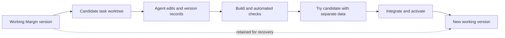

# Customization through worktrees, previews, and undo

## Status and scope

**Deferred design discussion, 16 September 2026. No implementation is requested for now.** The user suggested Git worktrees as a likely better foundation after reviewing Margin's checkpoint experience. Treat worktrees as the leading direction to investigate, not a finalized architecture or authorization to create them.

The immediate scope is customizing **Margin itself**. Whether to offer the same workflow for ordinary project workspaces remains open. Existing checkpoint behavior, the committed hang fix, and the distinction between checkpoints and normal branch commits are documented in [checkpoints.md](checkpoints.md).

This discussion revisits the earlier preference for direct source editing in this particular customization workflow. It does not replace the existing cco execution requirements or establish a mandatory Apply/Discard step for every project. The activation interaction still needs a decision.

## The problem to solve

The current History interface exposes generic names such as **Before customization** and asks users to inspect code diffs before restoring. Someone asking an agent to customize an app may be unable to judge that diff. Users need to recognize what changed, try the behavior, and undo a mistake without understanding Git references or restarting a broken server manually.

The recent freeze also showed that an internal save operation can block the product itself. Making snapshots faster matters, but a better label alone does not fix either blocking execution or the difficulty of reviewing code.

The desired experience is:

- Changes have names based on their visible outcome and are linked to the request that caused them.
- Users review the working interface and behavior. Code diffs and Git hashes are optional technical details.
- Trying, accepting, undoing, and redoing a change have clear effects.
- A broken candidate does not take down the working Margin installation or its recovery controls.
- Routine saves are quick and unobtrusive; failures have bounded recovery and preserve drafts.

## What worktrees contribute

A Git worktree is another checkout of the same repository, with its own working files, `HEAD`, and staging index, while sharing repository objects and ordinary branch references. It can hold a separate task branch without switching the original checkout. Git normally prevents the same branch from being checked out in multiple worktrees. See the [official Git worktree documentation](https://git-scm.com/docs/git-worktree).

For Margin, this suggests keeping the working app on its current version while an agent develops a candidate in another checkout. The candidate can be built and run separately for evaluation. Commits on the task branch record successive changes; worktrees provide the place to develop and run those versions.

**Worktrees are not themselves an undo system or a runtime sandbox.** Margin still needs version records, process supervision, preview data isolation, an integration policy, and an activation/recovery mechanism. They do not make a Git operation immune to hangs, copy uncommitted edits automatically, or resolve conflicts between competing changes.

## Proposed workflow to explore

The following is a proposal, not current behavior:

1. **Establish the starting state.** Record the active version and the exact source state the user expects the agent to edit, including how existing uncommitted work is handled.
2. **Prepare a candidate.** Create a managed worktree and task branch. Associate them with a stable task/conversation ID. Keep the original source checkout and staging area intact.
3. **Develop and record revisions.** Let the agent edit the candidate. Save identifiable revisions for meaningful turns, including follow-up edits, and record which request produced each revision.
4. **Build and check it.** Run automated checks outside the process serving the working app. Failed builds, hung commands, and canceled tasks leave that app usable.
5. **Try the behavior.** Launch a candidate preview with its own process, port, build output, and controlled data. Offer a specific interaction to try and, where useful, screenshots or a before/after comparison.
6. **Integrate and activate.** Reconcile the candidate with the current accepted source, test the resulting version, and switch the running app through a managed activation path. Preserve a known working version for recovery.
7. **Keep useful history.** Record the accepted result, its predecessor, relevant request, checks, and activation outcome. Retain unfinished candidates until the user discards them or a defined retention policy applies.

Creating a worktree per editable task, with follow-ups on the same branch, is a candidate default. A worktree per conversation may be simpler for long explorations, but conversations do not always correspond to one change. A worktree per message may create unnecessary setup and cleanup work. This choice is not settled.

## What the user would see

A hypothetical completion card could read:

> **Improved the task-conflict warning**
>
> When another task blocks sending, Margin explains why and provides a link to that task.
>
> **Try this version** · **Use this version** · **Discard draft**
>
> Technical details ▸

The example illustrates explicit activation. An alternative is automatic activation after checks, followed by **Undo last change**. The earlier recommendation favored automatic activation for quick personal customization; the worktree proposal makes a separate candidate preview attractive. **The user has not selected between these interactions.** Worktrees can support either.

“Try this version” should open the relevant view and suggest an interaction, such as starting a task and opening another chat to inspect the conflict notice. A generated summary or screenshot is useful context, but cannot prove functional correctness. The preview must actually run, and the check report must describe checks that really ran.

History should show recognizable changes, dates, and their originating requests. Discussion turns that do not change code should not clutter the visible version list. Whether they require an internal baseline check is an implementation detail, not another user-facing save prompt.

## Undo, redo, and natural-language requests

Keep these operations distinct:

| User action                     | Intended meaning                                                                                                                                                                 |
| ------------------------------- | -------------------------------------------------------------------------------------------------------------------------------------------------------------------------------- |
| Undo the latest change          | Return to its recorded predecessor, preserving a redo path and handling activation. Detect unrelated edits made since that version before replacing anything.                    |
| Return to this version          | Restore an entire earlier app version. Explain which later changes will also disappear.                                                                                          |
| Remove just this earlier change | Have the agent create a new reversal while preserving later work where possible, then test it. This may need conflict resolution and cannot promise an exact one-click reversal. |
| Discard a candidate             | Leave the accepted version untouched. Stop its processes and preserve or explicitly discard unfinished work before cleanup.                                                      |

For example, suppose the agent changes the layout and later improves the warning text. Returning to the version before the layout change also removes the warning improvement. Removing only the layout change should attempt to keep the warning improvement. Dependent changes may make that impossible without further editing; explain that outcome rather than silently dropping later work.

“Undo the last change” in chat could invoke a managed version action tied to the request, rather than asking the agent to guess a Git command. Selecting an ambiguous older change needs a clear description of its effects. Code rollback should preserve chats and notes; database changes and external side effects require separate treatment.

## Engineering questions worktrees do not answer

### Existing uncommitted changes

A new checkout based only on the branch tip can omit code the user is currently using. Define how the candidate inherits the intended eligible working-file state without committing unrelated work onto the user's branch or disturbing their staging area. Record that baseline separately from the candidate's own changes. Test promotion when the original checkout already has both staged and unstaged edits.

### Data, identity, dependencies, and previews

The candidate must not accidentally use the live SQLite database, live migrations, or production external effects. Choose test fixtures or a deliberate isolated data copy; define credentials and external-service behavior separately. Distinct localhost ports alone are insufficient isolation, including for browser authentication and storage.

Margin currently derives the default data directory from its app root, sets Pi configuration from that data directory, and distinguishes the source workspace by its path. See [installation setup](../scripts/installation.ts) and [workspace data routing](../server/workspace-data.ts). A worktree-based design needs a stable logical app/conversation identity across checkout paths, with explicit per-preview data and authentication boundaries.

Candidate dependencies and build artifacts also need a lifecycle. Reusing caches may reduce setup time, but sharing writable dependency/build directories across differing versions can produce incorrect previews. Measure cold and warm startup rather than assuming worktree creation is the whole cost.

### Integration and activation

Decide whether accepted changes merge into the user's branch, are promoted as a separate release revision, or use another explicit policy. If the accepted base changes while a candidate is being developed, integrate against that newer base and validate the result. A preview of the old candidate is not proof that the integrated version behaves identically.

Activation must handle worker shutdown, startup failure, browser reconnection, and data compatibility. The component that can return to a known working version must remain available when candidate app code fails. A code version and a running release need separate recorded identities; committing code alone does not activate it.

### Concurrency and process ownership

Separate worktrees can isolate file edits, but tasks still share Git objects/refs and may affect shared services. Keep existing sandbox boundaries and register candidate processes under their managed task identity. Serialize conflicting integration/activation operations and verify old runtime termination before starting an acting replacement. Do not remove current source-send guards until the replacement ownership model is established and tested.

### Performance and storage

Worktrees may reduce the need for full source snapshots on every message, but that needs measurement. Preserve the pipe-hang fix and bounded subprocess handling in any reused checkpoint paths. Add deadlines for complete operations and keep expensive work off the UI-serving thread.

Track disk use, unfinished work, commits, preview processes, dependencies, and retained releases. Define cleanup and recovery from a half-created or abandoned candidate. Retention must preserve active versions, redo/return targets, and unaccepted work. Existing checkpoint refs/journals need a migration or continued-access plan before replacing the old History UI.

## Decisions to resume with

1. Confirm initial scope: Margin self-customization only, or ordinary project workspaces too.
2. Choose the unit of candidate work: editable task, conversation, or another explicit unit.
3. Choose activation UX: explicit **Use this version**, automatic after checks with Undo, or a defined combination.
4. Define how the candidate includes existing uncommitted work and how accepted changes reach the user's branch.
5. Define preview data/credential isolation and how live data compatibility is assessed at activation.
6. Define latest-change undo, older-version restore, selective reversal, and the retention/cleanup policy.

These are recorded for later discussion; no answers are required now.

## Suggested first evaluation when work resumes

Build a bounded prototype in a disposable installation. Use one realistic customization, such as improving the send-conflict warning, and exercise these cases:

- Develop and try the candidate while the original app remains usable.
- Fail its build, hang a child command, and cancel the task; confirm bounded cleanup and an unaffected active version.
- Accept a successful candidate, verify it is the version actually serving requests, then undo and redo it.
- Preserve chats, notes, existing staged/unstaged code, and newer drafts across preview and activation.
- Advance the accepted base during candidate development and verify integration plus retesting.
- Reverse an earlier layout change while retaining a later warning fix; distinguish supported selective reversal from whole-version restore.
- Recover after activation/startup failure without needing the broken candidate to repair itself.
- Verify that preview traffic cannot write live data or reuse live browser credentials accidentally.
- Measure setup time, send latency, event-loop responsiveness, activation time, and retained disk space against the current workflow.

Use those results to decide whether worktrees should replace the current customization path or support an optional draft/preview mode. No such prototype or evaluation has been run for this proposal.
