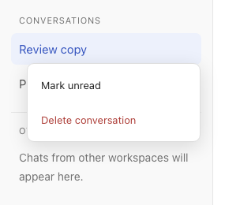
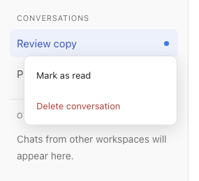
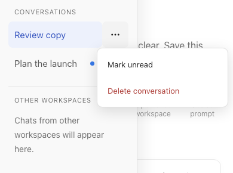

# Margin 0.1.1 — Conversation read controls

A highlighted patch release that makes it easier to leave a conversation for later, on desktop and mobile.

## Mark conversations unread—or read

Right-click a conversation in the sidebar and choose **Mark unread**. An unread conversation offers **Mark as read** instead. The read/unread action comes first; **Delete conversation** stays last.

 

- Marking the current chat unread keeps it open. The reminder survives reloads instead of disappearing just because the reply is visible.
- Explicitly selecting the chat again resumes normal read detection; **Mark as read** clears the reminder immediately. A later reply can make it unread again.
- Empty conversations can also be marked unread. Changes synchronize between tabs on the same browser origin, not across devices or ports.
- Running chats retain **Stop conversation** between the read action and Delete. Deletion still requires confirmation and is unavailable while the conversation is active.

## Mobile menus, with a single-tap fallback

Long-press a conversation to open the same menu, or tap its **⋯** button on narrow or touch-capable screens. Moving your finger to scroll cancels a pending long-press; releasing a completed hold does not open the conversation accidentally.

Keyboard access remains available with **Shift+F10**, arrow keys, and Escape. Menus stay inside the viewport and provide larger touch targets.

## Updating from 0.1.0

This release is highlighted so an older installation can show **Update available**. Highlighting is independent of the version number: this is still a small UX patch, not an automatic installation.

1. Use **Update available**, or **Settings → Margin updates → Review update**, to review the proposed update. With a configured AI connection, Margin starts a read-only review request pinned to the release commit; without one, it opens the release notes.
2. Review local changes and approve the update before source files are changed. Preserve `.margin-data`, `.git`, project folders, and local customizations.
3. Finish active work before applying and activating the update. Build the updated checkout with `npm run build`, stop its existing launcher, restart with `bash start.sh` and your usual port options, then refresh the browser. Pulling source or refreshing alone does not rebuild the app.

See [the release and activation guide](../../docs/releases.md) and [installation preservation](../../docs/installation.md). Do not run the fresh-install installer over an existing installation.

## Scope and verification

The **v0.1.0** tag identifies the existing baseline immediately before these sidebar changes. It is a historical installation reference, not a claim of a previously announced release. **v0.1.1** is the first release advertised through the stable update feed. Margin's existing workspace, inline-feedback, artifact-review, provider-connection, and customization features remain unchanged.

Compared with that baseline, this patch makes no dependency, database-schema, server-API, agent-permission, or sandbox-boundary changes. Read markers remain local to the browser origin. It is not designated a security release.

Feature checks passed in Chromium and WebKit, including menu order, unread persistence, keyboard access, and mobile-size touch controls. Screenshots above use disposable example conversations. Emulated browser checks do **not** establish physical iOS/Android or Safari keyboard compatibility. Real-device checks, native sandbox enforcement, and live-provider inference remain separate manual checks. Margin remains an early release for technical users.
